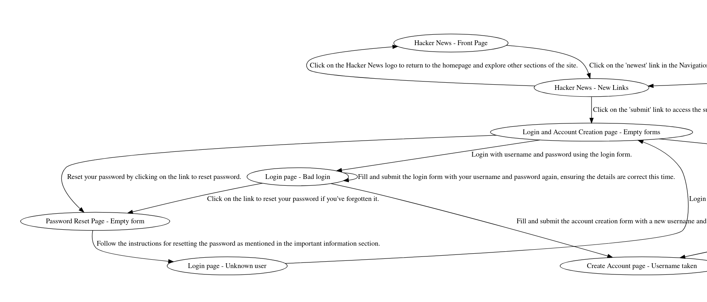

# AI Web Explorer

This repository contains an autonomous web explorer built on top of LLMs. The web explorer
acts as a very intelligent web scraper. Unlike a very simple scraping solution it can perform
more complex interactions such as clicking on buttons, or filling forms. This means
the web explorer can access many states invisible to normal scrapers such as a login form with
a message saying that the password is incorrect.
It also understands the content of the pages it visits and the meaning of actions it performs.

The output of the web explorer is a something aking to a state machine of a given website
- a graph of visited states and actions that can be performed to reach them.

At profiq we are interested in using LLMs to automate testing on the web. Web explorer can be
uset to create a knowledge base that can be then used to suggest test cases and to automate
their implementation.

## How it works

Here is a basic schema of how the web explorer works:


1. User provides the domain of the website they want to explore.
2. A [Playwright](https://playwright.dev/python/) instance is created and the website is opened.
3. The LLM is used to generate a title for the current state, e.g. "Login - Empty form".
4. The explorer checks whether it has already visited a state with a very similar title. If it has,
   it sets that state as current. If not, it creates a new state and uses an LLM to generate a textual
   description of the page and a list of possible actions to perform.
5. The explorer selects a random action from the list of possible actions it hasn't tried yet 
   and performs it. If no more actions are available, it checks other states for available actions.
   If there are no more actions available, the exploration is finished.
6. Steps 3-5 are repeated for a given number of iterations.
7. The output is a state machine in a dot or JSON format.

Here is an example of a state machine generated by the web explorer for Hacker News:



## Installation

We use the Rye package manager to manage dependencies. You can install it by following the
instructions at https://rye-up.com/.

After you have Rye installed, you can install the web explorer by cloning this repository
and installing required dependencies:

```bash
git clone https://github.com/profiq/ai-web-explorer.git
cd ai-web-explorer
rye sync
rye run playwright install
```

## Usage

The web explorer is a command line tool. You can run it by executing the following commands:

```bash
export OPENAI_API_KEY=[YOUR_OPENAI_API_KEY]
rye run explore [DOMAIN] -i [NO_OF_ITERATIONS]
```

Where `[DOMAIN]` is the domain of the website you want to explore. Do not include `http://` or `https://`.
The `[NO_OF_ITERATIONS]` parameter specifies how many iterations the web explorer should perform.

The web explorer will start exploring the website and will output the state machine it has 
discovered in a dot format. Dot graphs can be turned into an image using the `dot` command line
tool or using online tools such as  [WebGraphviz](http://www.webgraphviz.com/).


### Additional options

- `-t` or `--store-titles` - swith into an interactive mode where you manually confirm the titles
  of the pages you visit and correct them if needed. Confirmen titles are stored in a JSON file
  together with the HTML content of the page. This JSON file can be then used to fine-tune an LLM
  to generate better titles in the future.

- `-l [LOGIN]` or `--login [LOGIN]` - if the website you are exploring requires a login, you can use this option
  to provide the login credentials. `[LOGIN]` should be a string in the format `username:password`.
  If you use special characters in the username or password, you should put the whole string in quotes.

- `-o [OUTPUT]` or `--output [OUTPUT]` - specify the output format of the state machine. You can choose between
  `dot`, `json` or `jsonsimple`. The `dot` format is great for visualizing the website as a graph. The `json`
  format is recommended for storing the full state of the exploration so you can continue it later. The `jsonsimple`
  format is a simplified version of the `json` format that skips certain attributes such as title embeddings or action
  priority. We recommend this option for processing the website "state machine" with other tools LLM prompts.

- `-r [STATE_PATH]` or `--restore [STATE_PATH]` - resume exploration from previous state. `[STATE_PATH]` should be
  a path to a JSON file containing the state of the exploration (can be created using the `-o json` option).

- `-a [TEXT]` or `--additional-information [TEXT]` - provide additional information that will be added to all LLM prompts
  to further guide the exploration.

## Future work

The web explorer is an ongoing research project. There are many things we would like to try and improve:

- Using different LLMs to generate titles and descriptions of the pages.
- Removing invisible elements from the page before generating titles, descriptions, and actions.
- Integrating it with other tools such as test case generators.
- Use collected titles to fine-tune an LLM to generate better titles in the future.

Feel free to contribute by reporting bugs or suggesting new features by creating an issue!

